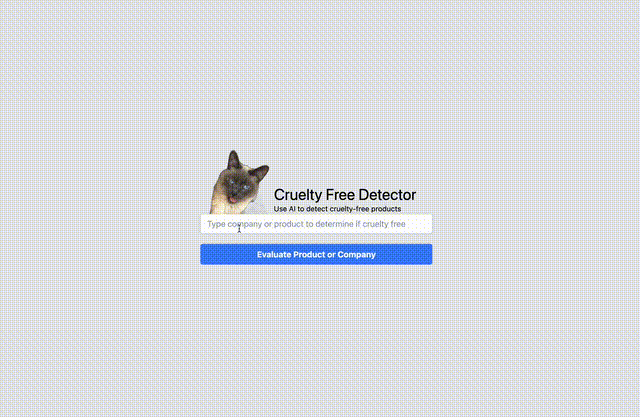

# GPT-Based Animal Cruelty Free Product Detector 

This is a simple project that explores the power of OpenAI's powerful `GPT3.5-turbo` completion API for detecting whether or not a given product or company is [cruelty-free](https://en.wikipedia.org/wiki/Cruelty-free).

# Demo

# Run Locally

This app is written in `Go`. To run, simple run `go mod tidy && go run main.go`

This will start the server that interfaces with Chat GPT. You can launch the simple UI from just opening the `index.html` page in your browser. 

_Note: Be sure to include your `OpenAI` API key in the `main.go` file so it can connect to the API server correctly._
